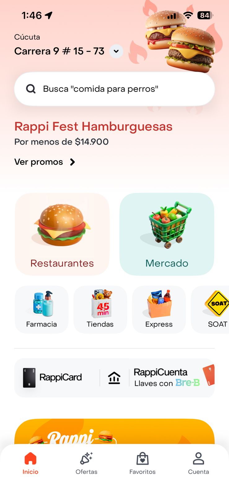

# Rizo_Arias-post1-u2

# Auditoría Heurística Nielsen - Rappi Android (Unidad 2 Post-Contenido 1)

**Estudiante:** Miguel Angel Rizo Arias  

**Materia:** Aplicaciones Móviles - Ingeniería de Sistemas UDES 2026

**Dispositivo:** iPhone 13 Pro 

**App auditada:** Rappi 

**Flujos críticos:**  
1. Home / búsqueda / onboarding  
2. Selección productos + carrito  
3. Checkout + pago  

**Justificación breve:** Estos flujos son los más críticos porque representan el viaje completo del usuario (descubrimiento → compra → pago). Problemas aquí causan alto abandono de carrito (>60-70% en delivery) y pérdida de usuarios en un mercado competitivo como Colombia.

**Estructura del repo:**  
- checklist_heuristico.md → Tabla con 10 heurísticas  
- reporte_auditoria.md → Hallazgos detallados + recomendaciones  
- evidencias/ → Capturas de pantalla (18 aprox.)

  
  
<strong>Pantalla principal de Rappi auditada (marzo 2026)</strong>

